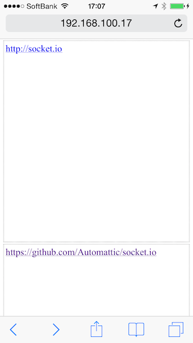
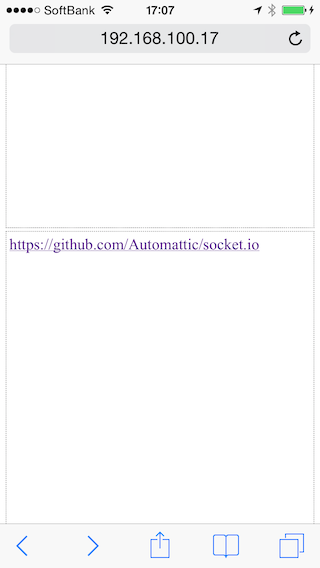

socket.io-cache-example
=======================

A sample app to illustrate page cache is cleared by socket.io

### Problem

Connecting to socket.io forces Mobile Safari and Android browser to clear page cache (bfcache).

To illustrate this problem, hide the main content initially and then switch to show when document is ready
so that browsers should not remember the current scroll position without page cache.

##### index.html

```
$(function() {
  var elem = $('#main');
  elem.removeClass('hide');
  elem.addClass('show');
});
```

Instructions:

1. Change localhost to your hostname in index.html
2. Start the server (`node app.js`)
3. Access to yourhost:3000
4. Scroll down
5. Click any link
6. Click the back button

You will see:

- If page cache is cleared, scroll position is set to the top.
- If page cache is retained, scroll position is remembered.

If you are using Mobile Safari or Android browser, you will see that page cache is cleared.



### workaround

Disconnecting socket before leaving page reactivates page cache.

"beforeunload" event is not supported by Mobile Safari,
so you need to bind an event of disconnecting socket to all links,
forms and other objects that have handlers to change location.

##### example

```
jQuery('a').click(function() {
  var href = $(this).attr('href');
  // check if href is not either hashchange or javascript
  if (href && href.indexOf('#' !== 0) && href.indexOf('javascript:' !== 0)) {
    // disconnect before unload for browser to retain page cache
    socket.disconnect();
  }
});
```

Follow the instructions again, and you will see page cache is retained this time.



### Resources

[WebKit Page Cache I – The Basics](https://www.webkit.org/blog/427/webkit-page-cache-i-the-basics/)

[WebKit Page Cache II – The unload Event](https://www.webkit.org/blog/516/webkit-page-cache-ii-the-unload-event/)
